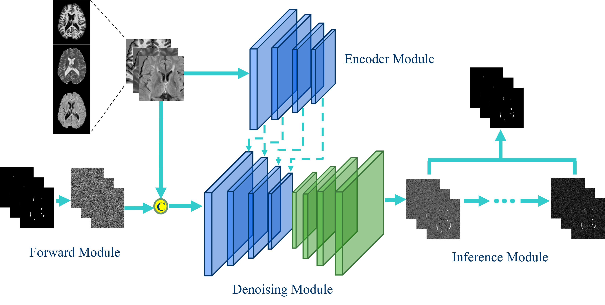

# A comparative evaluation of diffusion based networks for Multiple Sclerosis lesion segmentation (MSSegDiff)

This is the official implementation of the paper   
["A comparative evaluation of diffusion based networks for Multiple Sclerosis lesion segmentation"]()

## Abstract
Semantic segmentation of Multiple Sclerosis (MS) lesions from longitudinal Magnetic Resonance Imaging (MRI) scans is crucial for the diagnosis and monitoring of disease progression.  
This study aims to evaluate the generalization performance of various deep learning segmentation models, commonly used in state-of-the-art medical image segmentation, when integrated into a diffusion model pipeline for segmenting MS lesions.

Through an extensive set of experiments, we assess the performance of diffusion models with different architectural configurations to identify the optimal model for MS lesion segmentation. Additionally, we explored the robustness of diffusion model predictions by implementing various inference strategies to combine the diffusion model outputs obtained at each time step.

Our results demonstrate the effectiveness of certain backbone architectures in enhancing diffusion model performance in MS lesion segmentation. Moreover, we demonstrate that accurate selection of inference strategies can further enhance the accuracy and robustness of diffusion model predictions.

This study contributes to advancing the understanding of diffusion models' applicability in clinical settings and provides insights for improving MS lesion segmentation in MRI.

## Architectures
The architecture used for the segmentation of MS lesions is called MSSegDiff, a diffusion model pipeline specifically designed for MS lesion segmentation tasks.

The following image represents the MSSegDiff pipeline architecture:



## Setup

To start, create and activate the necessary Conda environment:

```bash
conda env create -f environment.yml
conda activate diffusion
```

## Dataset
We release the codes which support the training and testing process on the ISBI2015 dataset.

The original ISBI2015 dataset can be downloaded here:
ISBI2015 Lesion Challenge Dataset

## Data Structure
Before training, the nifti files must be structured in the following format:


```bash
ISBI_2015
└───ISBI_Training_01
    │───training01_01_flair_pp.nii.gz
    │───training01_01_mask1.nii.gz
    │───training01_01_mprage_pp.nii.gz
    │───training01_01_pd_pp.nii.gz
    │───training01_01_t2_pp.nii.gz
    ├...
    ├...
    ├...
    ISBI_Training_21
    │───training05_04_flair_pp.nii.gz
    │───training05_04_mask1.nii.gz
    │───training05_04_mprage_pp.nii.gz
    │───training05_04_pd_pp.nii.gz
    │───training05_04_t2_pp.nii.gz
```

Training
To start training, use the following command. You can modify the training parameters by referring to **train.py** and adjusting the arguments.

```bash
python train.py
```

Make sure to explore the argument options in train.py to customize the training process, such as batch size, learning rate, and number of epochs.

Testing
Once the training is completed, you can run the testing phase with the following command. Similar to training, you can modify the testing parameters by checking **test.py** and adjusting the arguments.

```bash
python test.py
```

